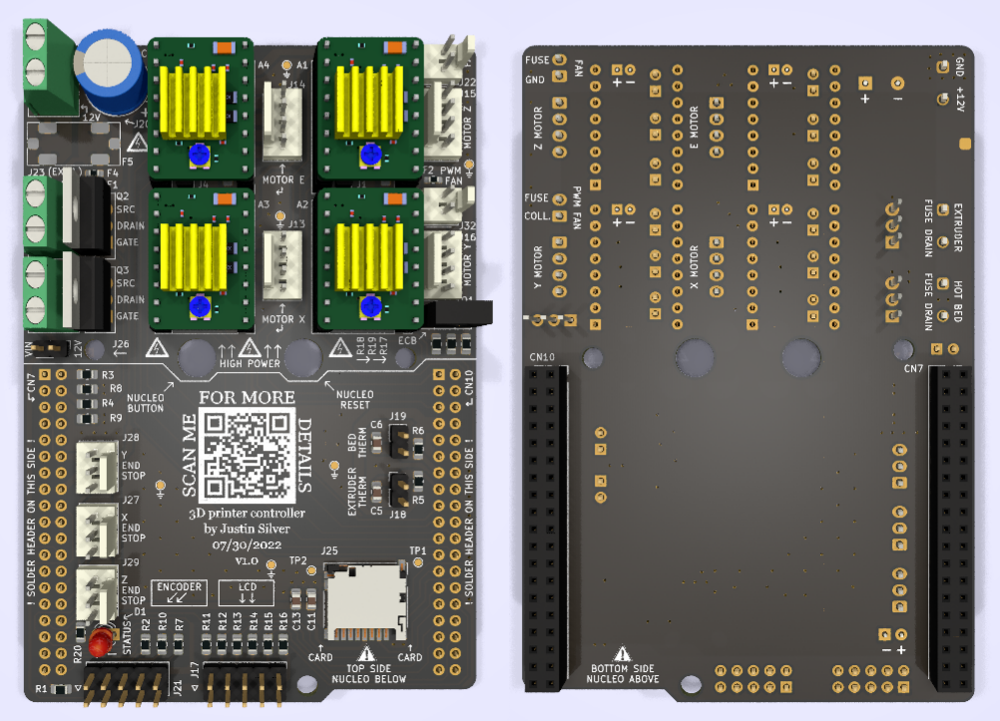

# STM32 Nucleo 3D printer controller

This project concerns the replacement of a Teensylu 3D printer controller board for a [uDelta RepRap printer](https://reprap.org/wiki/Micro_Delta). An STM32 NUCLEO-F446RE expansion board (shield) is currently being developed as the replacement. After the board is designed and fabricated, the Marlin open source firmware will be configured for use with the Nucleo board.

# Folder structure

**./kicad/stm32_nucleo_expansion/**
- Contains all the CAD files for the shield PCB

# Power usage
I will be using a [S-240-12 12 V 240 W power supply](https://www.meanwellusa.com/upload/pdf/SP-240/SP-240-spec.pdf) Here is an approximate distribution of the power consumption:

## High power usage

### Pololu stepper motors
- [StepStick from RepRap](https://www.reprap-france.com/produit/363-pilote-de-moteur-pas-a-pas-stepstick)
- Max current of 2 A per coil, with overcurrent output protection at 2.1 A
- On-board current limit via potentiometer needs to be checked (TODO)

### Extruder
- 12 V, 3.5 A (40 W) [as specified here](https://www.reprap-france.com/produit/380-cartouche-de-chauffe-12v-40w)

### Bed
- 12 V, 3.5 A (40 W) [as specified here](https://www.reprap-france.com/produit/1234568345-kit-plateau-chauffant-pour-microdelta-originale)

### Extruder fans
- 12 V, 0.18 A (2.16 W) [as specified here](https://www.reprap-france.com/produit/1234568367-ventilateur-turbine-40x10mm-12v)

## Low power usage

### NUCLEO-F446RE
- Supplied with USB 5 V: [300 mA max input current](https://www.st.com/resource/en/user_manual/um1724-stm32-nucleo64-boards-mb1136-stmicroelectronics.pdf#page=20)
- Supplied with external 12 V: [250 mA max input current](https://www.st.com/resource/en/user_manual/um1724-stm32-nucleo64-boards-mb1136-stmicroelectronics.pdf#page=21)
- Measure current consumed by NUCLEO board via JP5 (TODO)

### Pololu stepper motors
- [Approximately 15 mA consumption](https://www.pololu.com/file/0J450/A4988.pdf) at 3.3 V: 50 mW

### microSD card
- [Approximately 150 mA for standard mode (25 MHz) at 3.3 V](https://images-na.ssl-images-amazon.com/images/I/91tTtUMDM3L.pdf): 500 mW

### LCD
- [Typical 1.1 mA consumption](https://www.openhacks.com/uploadsproductos/eone-1602a1.pdf). At 5 V: 5 mW

# PCB
The shield is a 2-layer board fabricated by JLCPCB. It plugs directly into the NUCLEO-F446RE via two 38-pin morpho connectors.

# Acknowledgments

- Design inspired by [Teensylu RepRap](https://reprap.org/wiki/Teensylu/fr)
- Kudos to [mobilinkd](https://github.com/mobilinkd/stm-morpho-template) for the STM32 morpho connector template
- Kudos to [bettak](https://grabcad.com/library/reprap-stepstick-stepper-motor-driver-module-1) for the RepRap StepStick 3D model
- Thanks to [r/PrintedCircuitBoard on Reddit](https://www.reddit.com/r/PrintedCircuitBoard/) for the advice and comments
